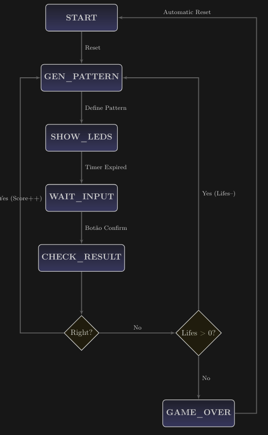
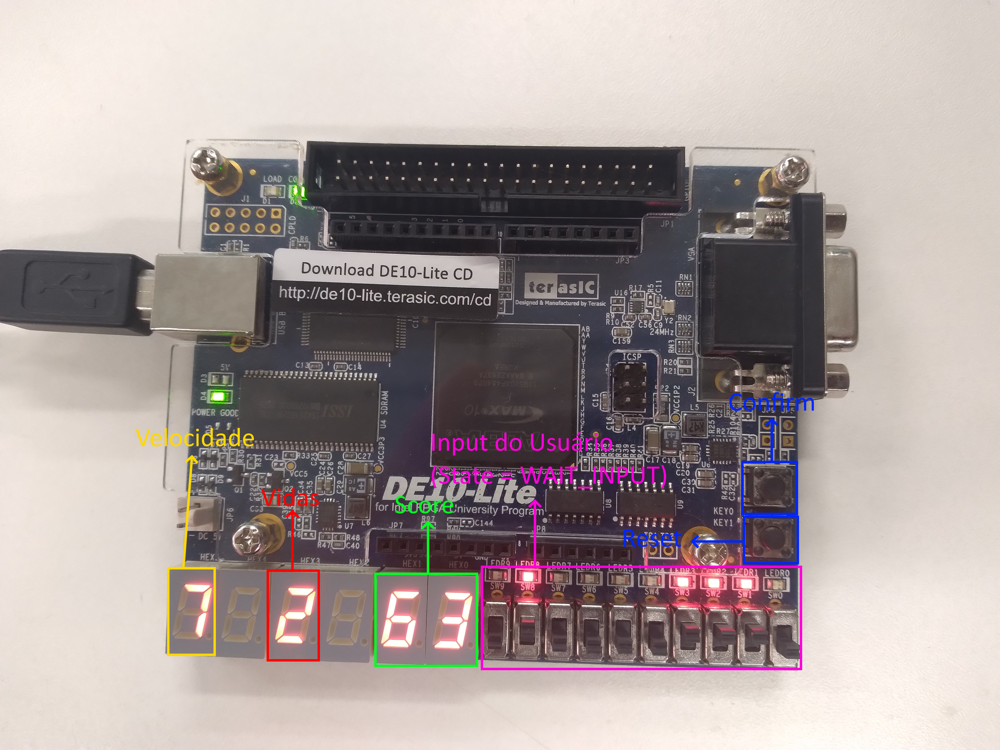

# FPGA Memory & Sequence Game (DE10-Lite)

**Device:** Intel MAX 10 (DE10-Lite Board)  
**IDE:** Quartus Prime Lite Edition  
**Language:** VHDL

---

## Table of Contents
1. [English Documentation](#english-documentation)
2. [Documentação em Português](#documentação-em-português)

---

## English Documentation

### Project Overview
This project implements a Memory and Sequence Game on an FPGA using the DE10-Lite development board. The system is designed as a digital circuit that generates pseudo-random patterns on the LEDs, which the user must memorize and reproduce using the input switches. The game features a complete game loop including scoring, a life system, dynamic difficulty adjustment (speed), and time limits.

### Key Features
* **Pseudo-Random Pattern Generation:** Uses a free-running counter to generate unpredictable 10-bit patterns.
* **Dynamic Difficulty:** The game speed increases automatically after a streak of 3 consecutive correct answers.
* **Scoring System:** Points are awarded based on the current speed level (higher speed = more points).
* **Life System:** The player starts with 3 lives. A life is lost upon an incorrect input.
* **Timer:** A programmable hardware timer limits the duration the pattern is visible.
* **7-Segment Display Interface:** Real-time display of current score, remaining lives, and speed level.

### Hardware Architecture
The project is structured in a modular fashion with `Memory.vhd` serving as the Top-Level entity.

* **Game_Controller:** Implements the Finite State Machine (FSM) managing the game logic.
* **Timer:** A parametric frequency divider that controls the pattern display duration.
* **Leds (PRNG):** A high-frequency counter used to capture random values based on user interaction timing.
* **Bin_to_dec / Bin_to_dec_2dig:** Decoders for converting binary values to 7-segment display formats (Active Low).

### Finite State Machine (FSM)
The core logic is governed by an FSM with the following states: `START`, `GEN_PATTERN`, `SHOW_LEDS`, `WAIT_INPUT`, `CHECK_RESULT`, and `GAME_OVER`.

*Figure 1: State Diagram of the Game Controller.*

### Implementation Results
The system was successfully synthesized and tested on the DE10-Lite board.

*Figure 2: Project running on the DE10-Lite FPGA board.*

### Pin Assignment Map
Based on the `Memory.qsf` file configuration:

| Signal Name | FPGA Pin | Component | Description |
| :--- | :--- | :--- | :--- |
| `clk_50MHz` | PIN_P11 | Clock | 50MHz System Clock |
| `reset` | PIN_A7 | Button/SW | System Reset |
| `confirm` | PIN_B8 | Button | Confirm Input Selection |
| `input[9..0]` | PIN_F15...C10 | Switches | User Input (SW9 to SW0) |
| `leds_out[9..0]` | PIN_B11...A8 | LEDs | Pattern Display |
| `lifeshex` | HEX0 | 7-Seg | Lives Display |
| `velocityhex` | HEX1 | 7-Seg | Speed Level Display |
| `scorehex` | HEX5-HEX4 | 7-Seg | Score Display (00-99) |

### How to Build
1.  Open the project file `Memory.qpf` in Quartus Prime (Lite or Standard).
2.  Ensure the device is set to **10M50DAF484C7G** (MAX 10).
3.  Run **Analysis & Synthesis** to check for errors.
4.  Run **Fitter (Place & Route)**.
5.  Run **Assembler** to generate the `.sof` file.
6.  Open the **Programmer**, connect the DE10-Lite via USB-Blaster, and upload the code.

---
---

## Documentação em Português

### Visão Geral do Projeto
Este projeto implementa um Jogo de Memória e Sequência em FPGA utilizando a placa de desenvolvimento DE10-Lite. O sistema foi projetado como um circuito digital que gera padrões pseudoaleatórios nos LEDs, os quais o usuário deve memorizar e reproduzir utilizando os switches de entrada. O jogo possui um ciclo completo incluindo pontuação, sistema de vidas, ajuste dinâmico de dificuldade (velocidade) e tempos limite.

### Principais Funcionalidades
* **Geração de Padrão Pseudoaleatório:** Utiliza um contador de livre execução (*free-running counter*) para gerar padrões de 10 bits imprevisíveis.
* **Dificuldade Dinâmica:** A velocidade do jogo aumenta automaticamente após uma sequência (*streak*) de 3 acertos consecutivos.
* **Sistema de Pontuação:** Os pontos são atribuídos com base no nível de velocidade atual (maior velocidade = mais pontos).
* **Sistema de Vidas:** O jogador inicia com 3 vidas. Uma vida é perdida ao inserir uma sequência incorreta.
* **Temporizador:** Um timer de hardware programável limita a duração em que o padrão permanece visível.
* **Interface de Display de 7 Segmentos:** Exibição em tempo real da pontuação atual, vidas restantes e nível de velocidade.

### Arquitetura de Hardware
O projeto está estruturado de forma modular, com `Memory.vhd` atuando como a entidade Top-Level.

* **Game_Controller:** Implementa a Máquina de Estados Finitos (FSM) que gerencia a lógica do jogo.
* **Timer:** Um divisor de frequência paramétrico que controla a duração de exibição do padrão.
* **Leds (PRNG):** Um contador de alta frequência usado para capturar valores aleatórios baseados no momento da interação do usuário.
* **Bin_to_dec / Bin_to_dec_2dig:** Decodificadores para converter valores binários para o formato de display de 7 segmentos (Lógica Active Low).

### Máquina de Estados Finitos (FSM)
A lógica central é governada por uma FSM com os seguintes estados: `START`, `GEN_PATTERN`, `SHOW_LEDS`, `WAIT_INPUT`, `CHECK_RESULT` e `GAME_OVER`.

*Figura 1: Diagrama de Estados do Controlador do Jogo.*

### Resultados da Implementação
O sistema foi sintetizado e testado com sucesso na placa DE10-Lite.

*Figura 2: Projeto em execução na placa FPGA DE10-Lite.*

### Mapa de Atribuição de Pinos
Baseado na configuração do arquivo `Memory.qsf`:

| Nome do Sinal | Pino FPGA | Componente | Descrição |
| :--- | :--- | :--- | :--- |
| `clk_50MHz` | PIN_P11 | Clock | Clock do Sistema 50MHz |
| `reset` | PIN_A7 | Botão/SW | Reset do Sistema |
| `confirm` | PIN_B8 | Botão | Confirmar Seleção de Entrada |
| `input[9..0]` | PIN_F15...C10 | Switches | Entrada do Usuário (SW9 a SW0) |
| `leds_out[9..0]` | PIN_B11...A8 | LEDs | Exibição do Padrão |
| `lifeshex` | HEX0 | 7-Seg | Display de Vidas |
| `velocityhex` | HEX1 | 7-Seg | Display de Nível de Velocidade |
| `scorehex` | HEX5-HEX4 | 7-Seg | Display de Pontuação (00-99) |

### Como Compilar e Executar
1.  Abra o arquivo de projeto `Memory.qpf` no Quartus Prime (Lite ou Standard).
2.  Certifique-se de que o dispositivo está definido como **10M50DAF484C7G** (MAX 10).
3.  Execute **Analysis & Synthesis** para verificar erros.
4.  Execute **Fitter (Place & Route)**.
5.  Execute **Assembler** para gerar o arquivo `.sof`.
6.  Abra o **Programmer**, conecte a DE10-Lite via USB-Blaster e carregue o código.
